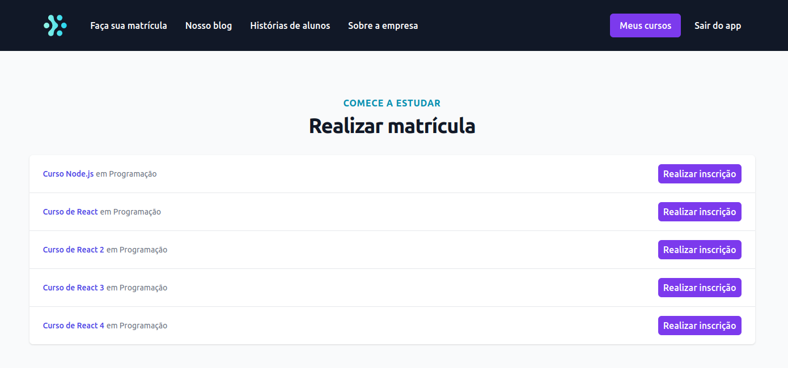
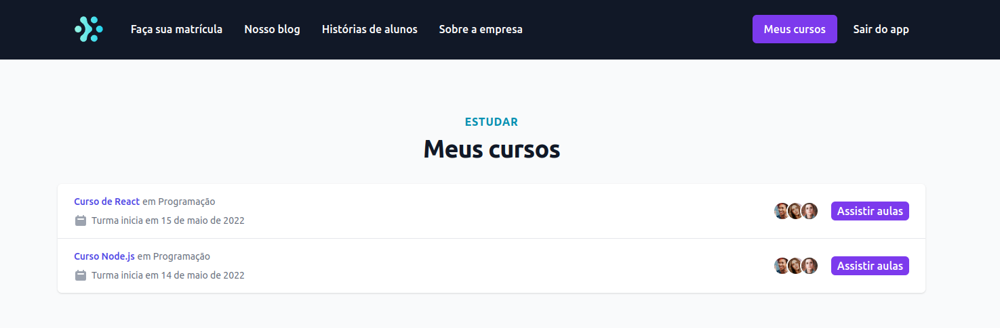

# Ignite lab




## Auth0

Criar conta
Criar tenant

## NestJS

Traz pronto parte de autenticão, integrações, graphql, receitas, validações, cache. Feito com typescript.

Usa muito arrobas @. Decorators.

Criar nestjs

```console
nest new purchases
```

Criar nestjs

```console
nest new classrooom
```

Criar web

```console
yarn create next-app web
```

Web

```console
yarn add typescript @types/react @types/node -D
```

No próximo yarn dev, ele cria tsconfig

Modulo no nest une varios arquivos em um so

```console
nest generate module database
nest generate module http
```
```console
```


```console
3815  npm i @nestjs/config
```

Middleware

```console
 3816  nest generate guard authorization --no-spec
```

```console
npm i express-jwt jwks-rsa
```

npm i @types/express -D
 
 
Web
```console
yarn add @auth0/nextjs-auth0
```

Nest Purchases

```console
npm i prisma -D
npx prisma init
```

Docker completo no repositório da rocket ignite lab 1

```console
touch docker-compose.yml
docker-compose up -d
docker ps
```

Migrar prisma

```console
npx prisma migrate dev
nest generate service prisma
```

Rodar nest
```console
npm run start:dev
```

```console
npx prisma studio
```

Grapql nest
```console
npm i @nestjs/graphql @nestjs/apollo graphql apollo-server-express
```
```console
npm install @apollo/subgraph
```
 
 
 em localhost:3331/grapql aparece insomnia do grapql


## Apollo Federation

Cria um gateway, que basicamente faz com que o frontend se comunique com uma url e gateway se comunica com quem for necessário.

Gateway faz um serviço de proxy. Para preencher o valor final para a web.

Gateway (localhost:3332/) PROXY

Purchases (localhost:3331/) purchases.rocketseat.com.br
Classroom (localhost:3334/) classrooom.rocketseat.com.br


Normalmente seria

localhost:3331/graphql
```console
query {
  me {
    purchases {
      id
    }
  }
}
```

localhost:3333/graphql
```console
query {
  me {
    enrollments {
      id
    }
  }
}
```

Com Gateway, com a mesma query me posso buscar enrollments e purchases

localhost:3332/graphql
```console
query {
  me {
    purchases {
      id
    }
    enrollments {
      id
    }
  }
}
```

Trocar driver
```console
npm install @apollo/federation 
```

Criacao do gateway

```console
nest new gateway
```

```console
npm i @apollo/gateway @nestjs/graphql @nestjs/apollo 
npm i apollo-server-express 
```

Talvez precise colocar em purchases e classroom
```console
npm i graphql@15
```

Para adicionar anotações na parte superior do schema.gql
```console
npm install @apollo/federation --force
```

# Web

Para fazer requisições, não vamos usar axios, pois ele deixa muito solto o que pode ser passado para ele.

Apollo, relay, urql são alternativas para realizar as requisições. Vamos usar apollo.

```console
yarn add graphql@15 @apollo/client 
```

Codegen no front, graphql codegenerator
Le querys graphql e gera códigos prontos com hooks de uma maneira automatizada
Mover queries para graphql queries

```console
yarn add @graphql-codegen/cli @graphql-codegen/import-types-preset @graphql-codegen/typescript @graphql-codegen/typescript-operations @graphql-codegen/typescript-react-apollo graphql-codegen-apollo-next-ssr -D
```

Utilizar yarn generate para criar queries com typescript. Copiar codegen.yml e criar pastas private e public


Para autenticação server side, auth0
```console
 yarn add next-http-proxy-middleware
```

Tailwind

```console
yarn add tailwindcss postcss autoprefixer -D
npx tailwindcss init -p
yarn add @headlessui/react @heroicons/react
yarn add @tailwindcss/forms @tailwindcss/aspect-ratio -D
```

Também existe Radix

Shimmer Loading widget acts as a skeleton layout.

```console
```


```console
```


```console
```


```console
```
```console
```


```console
```


```console
```


```console
```


```console
```